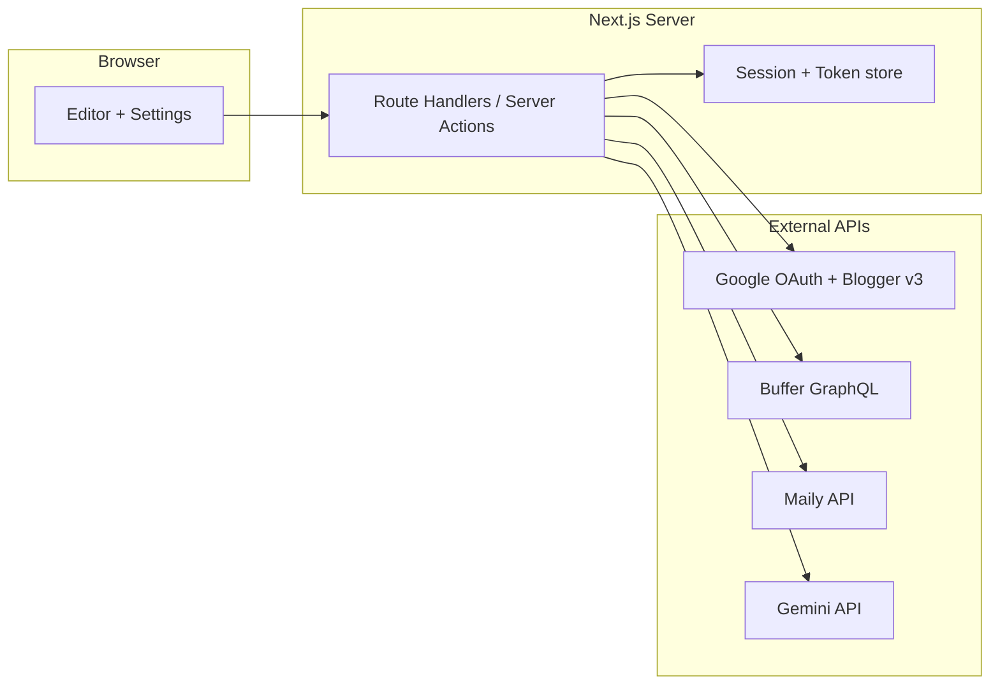

# MVP 스택·경계 (Superpower ① 결정)

**상태:** LOCKED for implementation kickoff (2026-05 기준)  
**단일 출처(제품 비전·제약):** [design-auto-posting.md](./design-auto-posting.md) — 본 문서는 **구현 스택·MVP 슬라이스 순서·외부 API 리스크 요약**만 고정한다.

---

## 1. 스택 확정

| 영역 | 결정 | 비고 |
|------|------|------|
| 프레임워크 | **Next.js (App Router)** + **TypeScript** | `src/app/`, Route Handlers `src/app/api/**`, 필요 시 Server Actions |
| 패키지 매니저 | **npm** (기본) | 팀이 pnpm 고정 시 `README`·본 표만 교체 |
| 인증·OAuth | **Auth.js (NextAuth.js) v5** 권장 또는 동등한 **서버 전용** OAuth 콜백 | 토큰은 **서버** 세션·DB·암호화 스토어만. 클라이언트 번들·`localStorage`에 시크릿·refresh 금지 — [DEVELOPMENT.md](./DEVELOPMENT.md) §4 |
| DB (MVP) | **선택** — P0는 세션만으로도 가능. 발행 큐·재시도는 **SQLite (Turso/libsql)** 또는 **Postgres**로 Phase 1.5 이후 도입 권장 | `design-auto-posting` Next Steps 8 |
| 스타일 | **Tailwind CSS** (선택, UI 빠른 고정) | 미도입 시 순수 CSS도 가능 |

**`.env.example`과 정합:** `NEXTAUTH_URL`, `GOOGLE_CLIENT_*`, `BUFFER_API_ACCESS_TOKEN`, 메일리·Gemini 주석 변수는 서버에서만 읽는다.

---

## 2. MVP 경계 (design 문서와 충돌 없음)

- **포함 (MVP 슬라이스 순 — 구현 순서):**
  1. **P0 — Blogger:** OAuth → 블로그 선택 → **초안 또는 발행 1건** (성공 기준은 `design-auto-posting` Success Criteria 첫 항목).
  2. **P1 — 네이버 보조:** Approach **A** — HTML 미리보기·복사·체크리스트만. 비밀번호 저장 UI **없음**.
  3. **P2 — 소셜:** 인스타·Threads 카피 생성 + **Buffer** `createPost` 또는 **복사 fallback**.
  4. **P3 — 뉴스레터:** HTML·제목 산출 + (선택) 메일리 API.
  5. **P4 — 카드뉴스:** 서버 **Gemini** → `_output/card-news/`.

- **명시 제외:** `design-auto-posting`의「명시적 범위 제외」절 그대로(유튜브·숏폼, 카페/밴드 등).

- **네이버 B(브라우저 자동화):** MVP **비포함**. 하드 요구 시 Phase 2「실험 모드」로 격리·기본 OFF.

---

## 3. 아키텍처 스케치 (OAuth·채널)

- **모든 third-party 시크릿**은 `next` 경계 안에서만 사용한다.

---

## 4. 외부 API — 스코프·리스크 한 페이지

| 서비스 | MVP에서의 역할 | 리스크·주의 |
|--------|----------------|-------------|
| **Google OAuth + Blogger v3** | P0 핵심. 스코프 `https://www.googleapis.com/auth/blogger` | 리다이렉트 URI·동의 화면·쿼ota. 토큰 유출 시 블로그 침해 |
| **네이버 블로그** | HTML 복사·가이드만 (공식 자동 발행 없음) | 과거 글쓰기 API 종료 전제 — 자동화 약속 금지 |
| **Buffer** | 인스타·Threads 큐 | 플랜·채널 연결·`createPost` 실패·Rate limit |
| **메일리** | 발송·구독자는 메일리 측. keg-book은 초안·트리거 | API 키·플랜·수신동의 정책은 메일리 문서 따름 |
| **Gemini** | 서버 전용 이미지 생성 | 안전 필터·약관·표시광고. 키 클라이언트 노출 금지 |

상세 검색 우선순위: [`.claude/superpower/config.md`](../.claude/superpower/config.md).

---

## 5. 구현 직후 확인할 것 (Open Questions 축소)

| 질문 | MVP 권장 답 |
|------|-------------|
| 호스팅 | **로컬 + Vercel** 병행 가정 — OAuth redirect에 스테이징 URL 추가 |
| 단일 vs 멀티 테넌트 | **단일 워크스페이스(KEG 마케팅팀)** 가정. 멀티는 후속 |
| Blogger 이미지 | **Phase 1.5**에서 외부 URL vs 업로드 전략 결정 |
| 설정 UI에 Client ID/Secret | **선택** — 기본은 `.env` + OAuth 연결만; 자가 호스팅 시 서버 암호화 저장 |

---

## 6. 다음 단계 (GSD ②로 넘김)

1. ~~루트에 `package.json` 생성(Next + TS + eslint).~~ **완료** — `npm run dev` / `npm run build`.
2. ~~`src/app` 최소 레이아웃 + `/api/auth/[...nextauth]` 또는 동등 OAuth 콜백.~~ **완료** — Auth.js v5 + Google(Blogger 스코프).
3. ~~Blogger `posts.insert` 스모크(샌드박스 블로그) + 블로그 선택 UI.~~ **완료** — `src/lib/blogger/createDraftPost.ts`, `src/app/blogger/actions.ts`, 홈 폼(`isDraft=true`).
4. ~~P1 — 네이버 보조 패널(HTML 복사·가이드).~~ **완료** — `/naver`, `src/lib/naver/*`, `NaverExportPanel`.
5. ~~P2 — 인스타·Threads 카피 + Buffer `createPost` 또는 복사 fallback.~~ **완료** — `/social`, `buildSocialPack`, Buffer GraphQL(토큰 있을 때), `_output/social-*` 저장.
6. ~~P3 — 뉴스레터 HTML·제목.~~ **완료** — `/newsletter`, `buildNewsletterHtml`, `_output/newsletter/` 저장.
7. ~~P4 — 카드뉴스 Gemini → `_output/card-news/`.~~ **완료** — `/card-news`, `@google/genai`(키 있으면 PNG), 항상 프롬프트 `.txt` 저장.
8. ~~**Phase 1.5 (일부)** SQLite 발행 큐·`/publish-queue`~~ **완료** — `data/keg-book.sqlite`, `publish_jobs` 테이블, 작업 추가·목록·취소(서버 액션). **워커**(예약 시각에 맞춰 Buffer/Blogger 호출·`pending`→`done`/`failed`)는 미구현.
9. ~~**Phase 1.5 (일부)** 메일리 API 라우트~~ **완료** — `GET /api/maily/status`, `GET|POST /api/maily/subscribers`(Bearer 프록시). 구독자 경로 기본 `/subscribers`, 다르면 `MAILY_SUBSCRIBERS_PATH`.

**이후(Phase 1.5+ 잔여):** 발행 **워커**·재시도 정책, Buffer **미디어 업로드**, Blogger **이미지 전략**, 메일리 **자동 이메일 트리거** 전용 라우트 등은 `design-auto-posting.md` Next Steps를 따른다.

본 문서를 바꿀 때는 **`design-auto-posting.md`와 모순되지 않게** 하고, 스택 변경 시 `CLAUDE.md` 상단 **Stack** 한 줄과 `README.md`를 함께 갱신한다.
